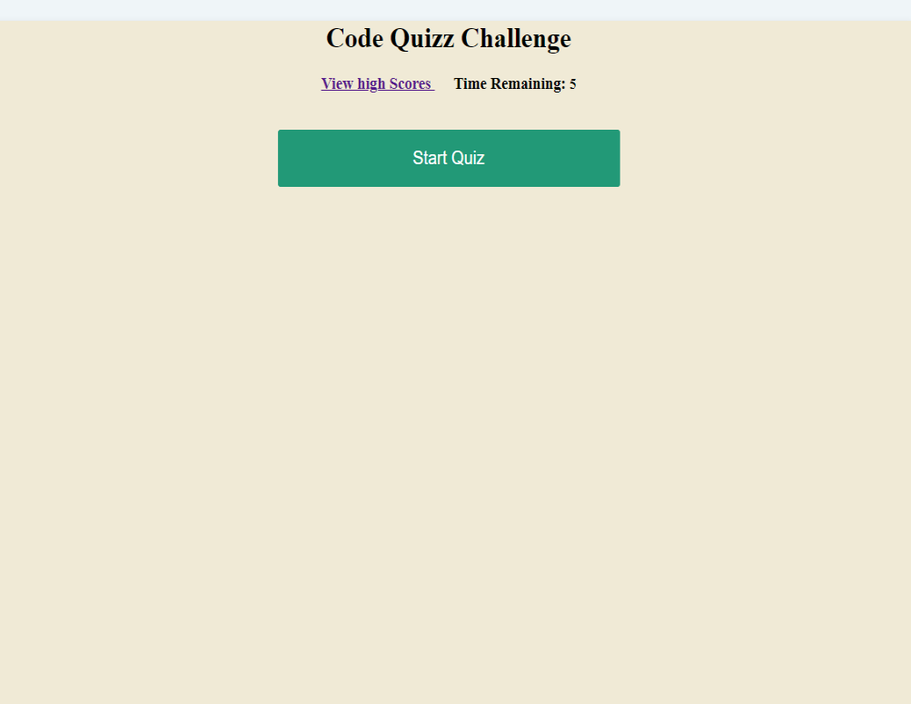

#Code Quiz challenge

This is a code quizz of 10 questions with a time set of 5 seconds.
When the user clicks to start the Game, a timer is also started
The player is then presented with the first randomly chosen question of the set.
When the user answers the question, he is presented with the next question in the set.
If the user's anwer is incorrect, time is subsracted from the clock.
If the user's answer is correct, it is stored.
When all questions are answered or the timer reaches 0
the game is over.
When the game is over, the user has the option of saving
his initials and his score.

Application Page Link : https://bkoala.github.io/Code_quiz/

Application Screen Shot : 